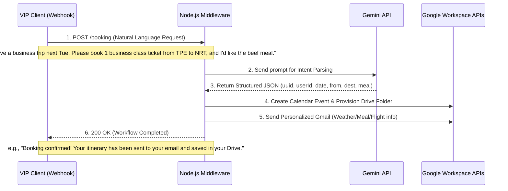
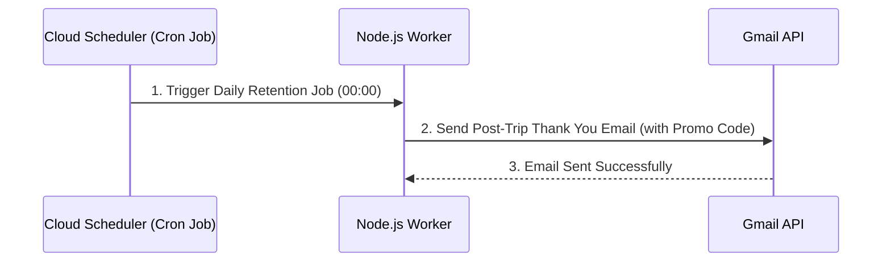

# Luxury Aviation Workflow POC

Enterprise-grade workflow automation for luxury business travel. Integrates Gemini AI for intent parsing and Google Workspace APIs for seamless orchestration.

## Business Problem

Current VIP concierge services face critical bottlenecks that degrade the luxury experience and limit scalability:

- **High-Friction Booking:** Manual and cumbersome processes make it inefficient for High-Net-Worth Individuals (HNWIs) to instantly confirm optimal flight schedules and seat availability.
- **Lack of 24/7 Availability:** VIPs are restricted by human agents' working hours, leading to unacceptable wait times for premium services.
- **Fragmented Itinerary Management:** Travel documents and booking details are scattered across different platforms. Updating or retrieving information requires highly inefficient manual data entry.
- **Reactive Customer Profiling:** Inability to proactively capture and integrate VIP preferences (dietary, health, habits) prior to departure, missing opportunities for hyper-personalized service.
- **Zero Post-Trip Lifecycle Management:** Lack of automated re-engagement workflows after the journey ends, losing potential Customer Lifetime Value (LTV) and retention.

## Proposed Solution

This POC demonstrates a streamlined, backend-driven integration layer that transforms unstructured VIP requests into automated enterprise workflows. The core focuses on a "Single Golden Path" API:

- **AI-Powered Intent Parsing (Gemini API):** A Node.js middleware that receives natural language requests from VIPs (via webhook) and uses Gemini Pro to extract structured JSON data (e.g., travel dates, destinations, dietary preferences like "Wagyu beef").
- **Automated Workspace Orchestration (Google APIs):** Instantly translates parsed VIP intents into actionable events. It automatically provisions Google Calendar invites and generates personalized itinerary documents without human intervention.
- **Proactive Hyper-Personalization (Gmail API):** Triggers automated, context-aware email communications. Based on the AI-extracted data, the system automatically sends pre-trip weather advisories, meal confirmations, and post-trip retention emails (with promo codes), ensuring a 24/7 premium touchpoint.

## Tech Stack

- **Backend Framework:** Node.js, Express, TypeScript
- **AI Engine:** Google Gemini API (Intent Parsing & NLP)
- **Enterprise Integration:** Google Workspace APIs (Calendar, Gmail, Drive)
- **Infrastructure & Deployment**: Docker, Google Cloud Run

## Architecture Diagram

### Before Travel

### After Travel

## Implementation Roadmap

- [ ] **Phase 1: Foundation & Webhook** - Set up Node.js/Express server and define webhook endpoints for client requests.
- [ ] **Phase 2: AI Integration** - Integrate Gemini API for Natural Language intent parsing and structured JSON extraction.
- [ ] **Phase 3: Workspace Orchestration** - Implement Google Calendar and Gmail API integrations via OAuth 2.0.
- [ ] **Phase 4: Deployment** - Containerize the application with Docker and deploy to Google Cloud Run.
